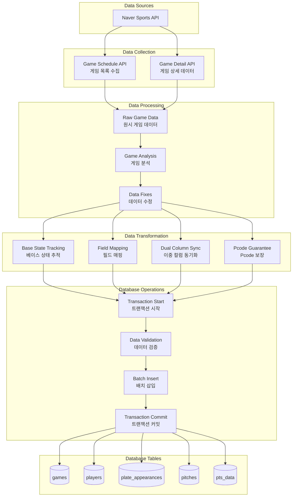
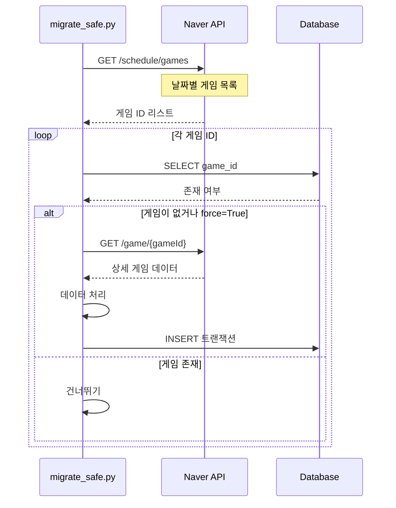
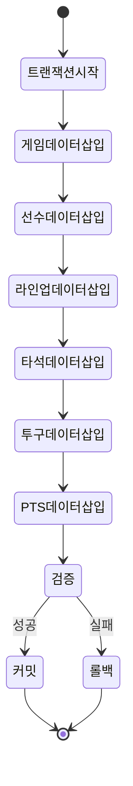
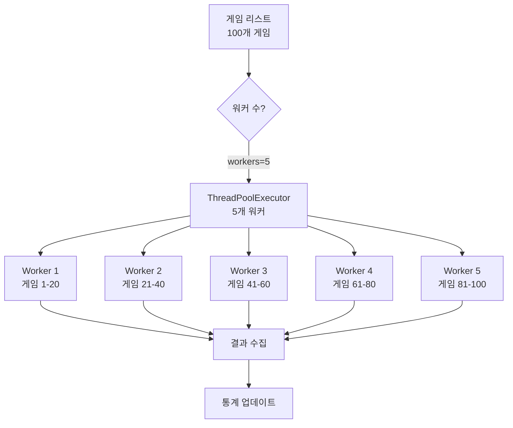
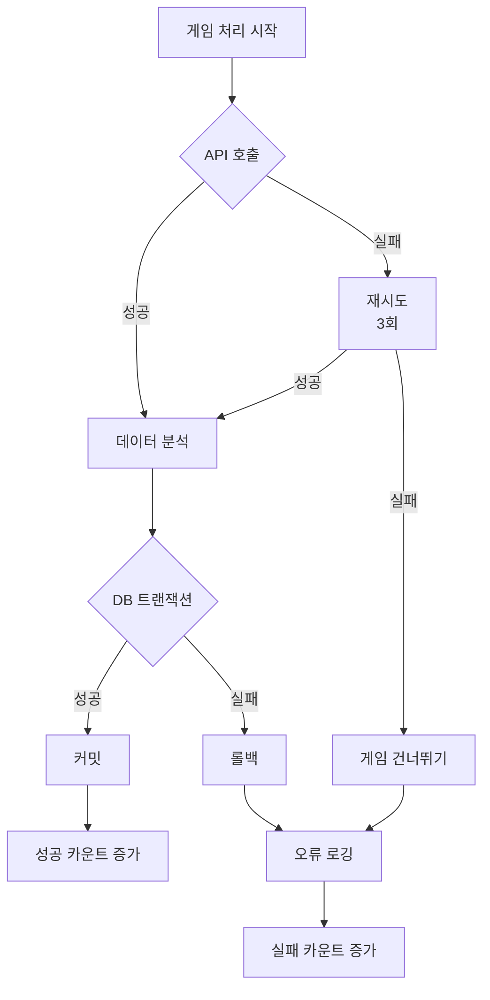
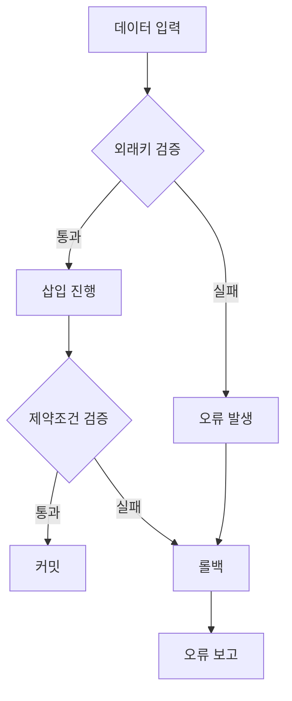

# 데이터 플로우 다이어그램

## 전체 데이터 흐름



## 게임 데이터 수집 플로우



## 베이스 상태 데이터 플로우

```mermaid
flowchart LR
    subgraph "API Data"
        A[currentGameState<br/>base1: 2<br/>base2: 0<br/>base3: 5]
    end
    
    subgraph "Analysis Phase"
        B[base1_batting_order: 2<br/>base2_batting_order: 0<br/>base3_batting_order: 5]
    end
    
    subgraph "Field Mismatch Fix"
        C[pre_base1_batting_order: 2<br/>pre_base2_batting_order: 0<br/>pre_base3_batting_order: 5]
    end
    
    subgraph "Dual Column Fix"
        D[pre_base1_batting_order: 2<br/>pre_base1_pcode: "2"<br/>pre_base2_batting_order: 0<br/>pre_base2_pcode: null]
    end
    
    subgraph "Database"
        E[(pitches table)]
    end
    
    A --> B
    B --> C
    C --> D
    D --> E
```

## 트랜잭션 처리 플로우



## 병렬 처리 데이터 플로우



## 오류 처리 플로우



## 데이터 변환 상세

### 1. 베이스 상태 변환

```python
# API 데이터
currentGameState = {
    "base1": 2,  # 2번 타자
    "base2": 0,  # 비어있음
    "base3": 5   # 5번 타자
}

# 변환 후
pre_base1_batting_order = 2
pre_base1_pcode = "2"
pre_base2_batting_order = 0
pre_base2_pcode = None
pre_base3_batting_order = 5
pre_base3_pcode = "5"
```

### 2. 필드 매핑

| 원본 필드 | 변환 필드 |
|-----------|-----------|
| base1_batting_order | pre_base1_batting_order |
| base2_batting_order | pre_base2_batting_order |
| base3_batting_order | pre_base3_batting_order |
| - | post_base1_batting_order |
| - | post_base2_batting_order |
| - | post_base3_batting_order |

### 3. 이중 컬럼 동기화

```mermaid
graph LR
    A[batting_order = 5] --> B[pcode = "5"]
    C[batting_order = 0] --> D[pcode = NULL]
```

## 데이터 무결성 보장


