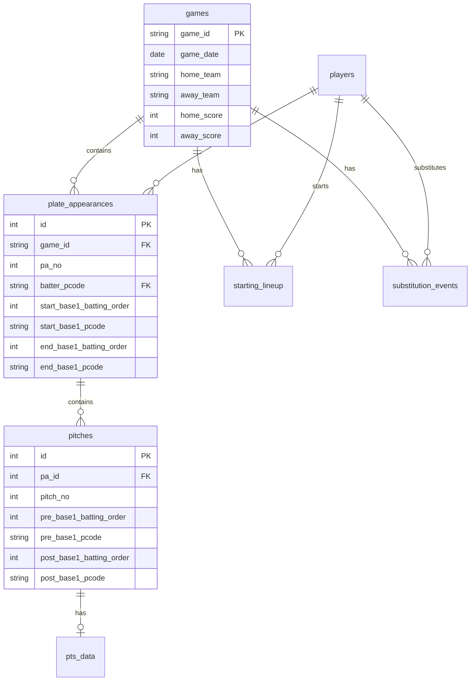
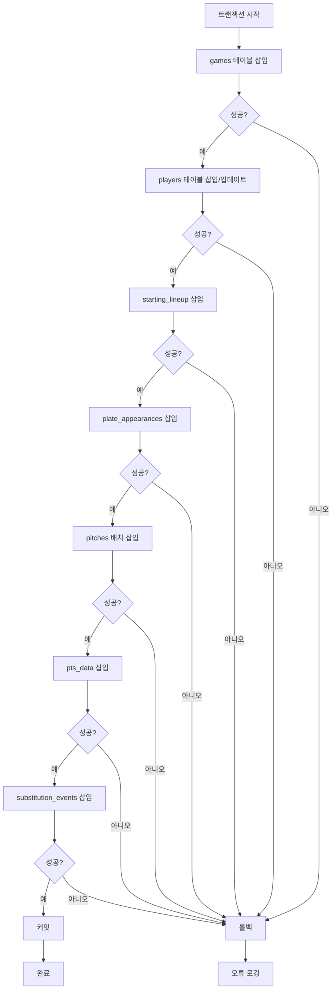
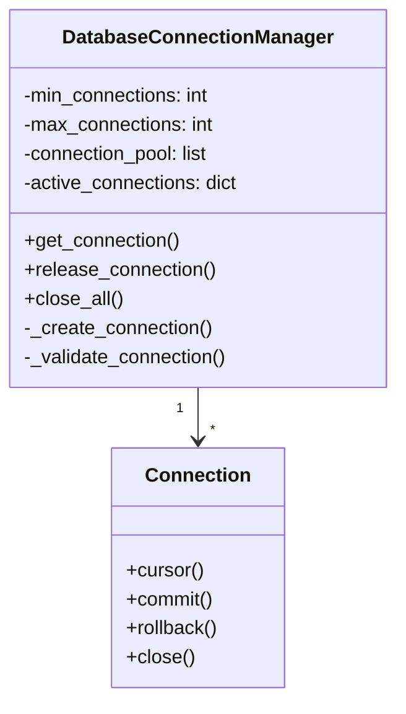
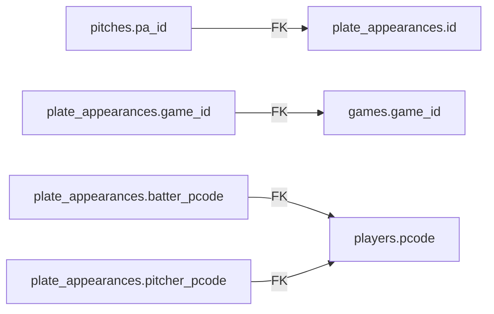
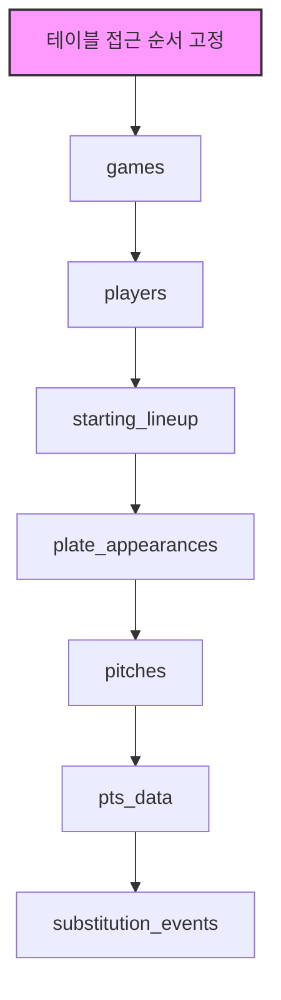

# 데이터베이스 작업 상세

## 데이터베이스 구조



## 트랜잭션 관리

### 트랜잭션 플로우



### 트랜잭션 격리 수준

```sql
-- 트랜잭션 시작 시 격리 수준 설정
SET TRANSACTION ISOLATION LEVEL READ COMMITTED;
```

## 테이블별 삽입 전략

### 1. games 테이블

```python
def _migrate_games_table_safe(self, analyzed_game_data: Dict, conn):
    cursor = conn.cursor()
    
    cursor.execute("""
        INSERT INTO games 
        (game_id, game_date, home_team, away_team, 
         stadium, home_score, away_score, status, created_at)
        VALUES (%s, %s, %s, %s, %s, %s, %s, %s, %s)
        ON CONFLICT (game_id) DO NOTHING
    """, (
        self.game_id,
        analyzed_game_data['game_info']['game_date'],
        analyzed_game_data['game_info']['home_team'],
        analyzed_game_data['game_info']['away_team'],
        analyzed_game_data['game_info']['stadium'],
        analyzed_game_data['game_info']['home_score'],
        analyzed_game_data['game_info']['away_score'],
        'FINAL',
        datetime.now()
    ))
```

### 2. players 테이블 (UPSERT)

```python
def _migrate_players_table_safe(self, analyzed_game_data: Dict, conn):
    cursor = conn.cursor()
    
    for player in all_players:
        cursor.execute("""
            INSERT INTO players (pcode, name, team, position, created_at)
            VALUES (%s, %s, %s, %s, %s)
            ON CONFLICT (pcode) 
            DO UPDATE SET 
                name = EXCLUDED.name,
                team = EXCLUDED.team,
                position = EXCLUDED.position,
                updated_at = CURRENT_TIMESTAMP
        """, (
            player['pcode'],
            player['name'],
            player['team'],
            player['position'],
            datetime.now()
        ))
```

### 3. plate_appearances 테이블 (베이스 상태 포함)

```python
cursor.execute("""
    INSERT INTO plate_appearances 
    (game_id, pa_no, inning, is_home_batting, 
     batter_pcode, pitcher_pcode, batting_order,
     start_base1_batting_order, start_base2_batting_order, 
     start_base3_batting_order, start_outs,
     start_base1_pcode, start_base2_pcode, start_base3_pcode,
     end_base1_batting_order, end_base2_batting_order, 
     end_base3_batting_order, end_outs,
     end_base1_pcode, end_base2_pcode, end_base3_pcode,
     result_code, result_detail, rbi, created_at)
    VALUES (%s, %s, %s, %s, %s, %s, %s, 
            %s, %s, %s, %s, %s, %s, %s,
            %s, %s, %s, %s, %s, %s, %s,
            %s, %s, %s, %s)
    RETURNING id
""", (...))

pa['db_id'] = cursor.fetchone()[0]
```

### 4. pitches 테이블 (배치 삽입)

```python
def _migrate_pitches_table_safe(self, analyzed_game_data: Dict, conn):
    cursor = conn.cursor()
    
    # 배치 데이터 준비
    pitch_values = []
    for pitch in pitches:
        pitch_values.append((
            self.game_id, pa_id, pitch['pitch_no'],
            pitch.get('pre_base1_pcode'),
            pitch.get('pre_base1_batting_order', 0),
            # ... 기타 필드
        ))
    
    # 배치 삽입
    execute_batch(cursor, """
        INSERT INTO pitches 
        (game_id, pa_id, pitch_no, pre_base1_pcode, 
         pre_base1_batting_order, ...)
        VALUES (%s, %s, %s, %s, %s, ...)
    """, pitch_values, page_size=100)
```

## 연결 풀 관리

### DatabaseConnectionManager 구조



### 연결 풀 설정

```python
# 최적 설정값
DB_POOL_CONFIG = {
    'min_connections': 2,
    'max_connections': 10,
    'connection_timeout': 30,
    'idle_timeout': 600,
    'retry_attempts': 3,
    'retry_delay': 1
}
```

## 성능 최적화

### 1. 배치 삽입

```python
from psycopg2.extras import execute_batch

# 단일 삽입 대신 배치 사용
execute_batch(cursor, insert_query, values_list, page_size=100)
```

### 2. 인덱스 활용

```sql
-- 자주 조회되는 컬럼에 인덱스
CREATE INDEX idx_pa_game_id ON plate_appearances(game_id);
CREATE INDEX idx_pitches_pa_id ON pitches(pa_id);
CREATE INDEX idx_pts_game_pitch ON pts_data(game_id, pitch_id);
```

### 3. 준비된 명령문

```python
# 준비된 명령문 사용
cursor.execute("PREPARE pa_insert AS INSERT INTO ...")
cursor.execute("EXECUTE pa_insert (%s, %s, ...)", values)
```

## 데이터 무결성 보장

### 외래키 제약 조건



### 제약 조건 검증

```python
def validate_foreign_keys(self, data: Dict) -> bool:
    """외래키 제약 조건 사전 검증"""
    
    # game_id 존재 확인
    if not self.check_game_exists(data['game_id']):
        return False
    
    # player pcode 검증
    for pa in data['plate_appearances']:
        if not self.check_player_exists(pa['batter_pcode']):
            self.create_player(pa['batter_pcode'])
    
    return True
```

## 락(Lock) 관리

### 테이블 레벨 락

```sql
-- 게임 처리 시 해당 게임 데이터만 락
SELECT * FROM games WHERE game_id = %s FOR UPDATE;
```

### 데드락 방지



## 모니터링 쿼리

### 처리 상태 확인

```sql
-- 날짜별 처리 상태
SELECT 
    game_date,
    COUNT(*) as total_games,
    COUNT(CASE WHEN status = 'FINAL' THEN 1 END) as completed,
    COUNT(CASE WHEN status = 'ERROR' THEN 1 END) as failed
FROM games
WHERE game_date BETWEEN '2025-03-22' AND '2025-07-10'
GROUP BY game_date
ORDER BY game_date;
```

### 데이터 품질 확인

```sql
-- 베이스 상태 데이터 품질
SELECT 
    COUNT(*) as total_pas,
    COUNT(CASE WHEN start_base1_pcode IS NOT NULL THEN 1 END) as has_base_state,
    ROUND(100.0 * COUNT(CASE WHEN start_base1_pcode IS NOT NULL THEN 1 END) / COUNT(*), 2) as coverage_pct
FROM plate_appearances
WHERE game_id LIKE '2025%';
```

## 백업 및 복구

### 증분 백업

```bash
# 특정 게임만 백업
pg_dump -t games -t plate_appearances -t pitches \
    --where="game_id='20250322WOSS02025'" \
    -U kbo_user -d kbo_baseball_db > game_backup.sql
```

### 복구 절차

```bash
# 특정 게임 데이터 삭제 후 복구
psql -U kbo_user -d kbo_baseball_db < game_backup.sql
```
