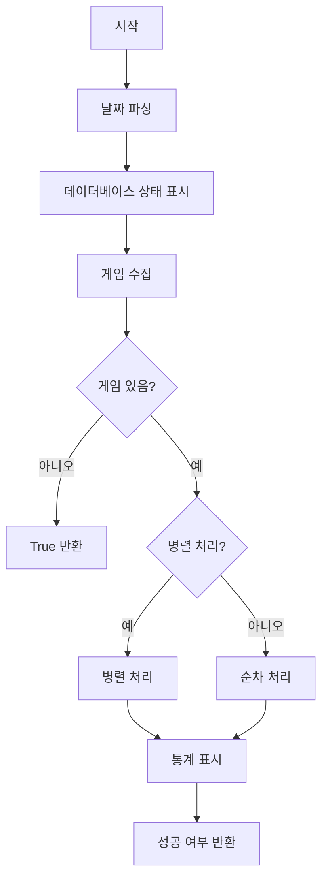
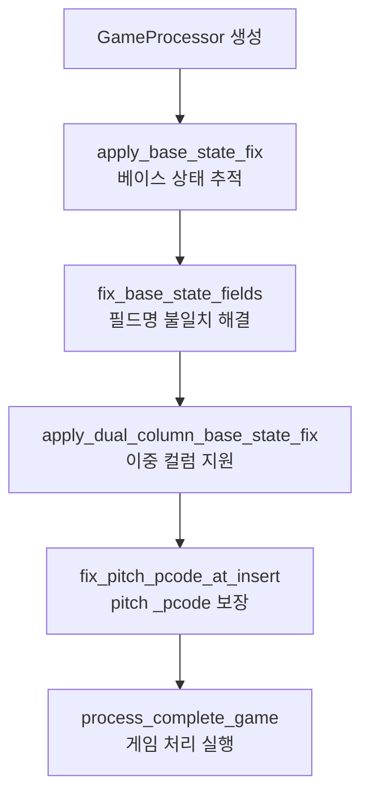
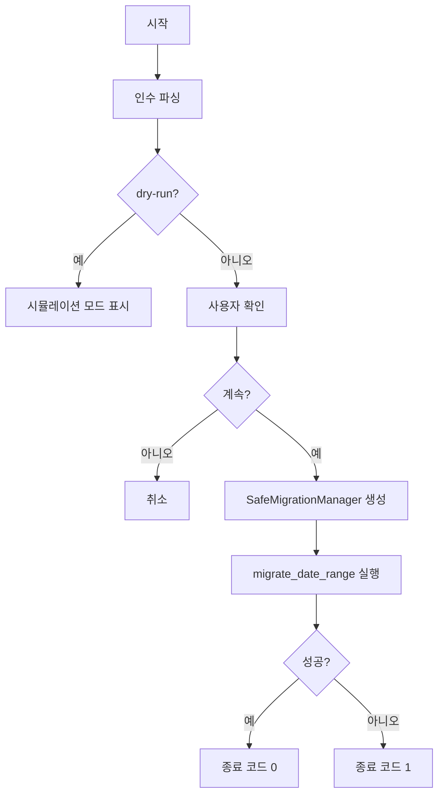

# 함수 레퍼런스

## SafeMigrationManager 클래스

### 생성자

```python
def __init__(self, db_config: dict, max_workers: int = 3)
```

**설명**: SafeMigrationManager 인스턴스를 초기화합니다.

**매개변수**:
- `db_config` (dict): PostgreSQL 연결 설정
  - `host`: 데이터베이스 호스트
  - `port`: 포트 번호
  - `database`: 데이터베이스 이름
  - `user`: 사용자명
  - `password`: 비밀번호
- `max_workers` (int): 병렬 처리 워커 수 (기본값: 3)

**반환값**: None

---

### migrate_date_range

```python
def migrate_date_range(self, start_date: str, end_date: str, force: bool = False) -> bool
```

**설명**: 지정된 날짜 범위의 게임을 마이그레이션합니다.

**매개변수**:
- `start_date` (str): 시작 날짜 (YYYY-MM-DD 형식)
- `end_date` (str): 종료 날짜 (YYYY-MM-DD 형식)
- `force` (bool): 이미 처리된 게임도 재처리할지 여부

**반환값**: 
- `bool`: 마이그레이션 성공 여부

**프로세스 플로우**:


---

### _collect_all_games

```python
def _collect_all_games(self, start_dt: datetime, end_dt: datetime) -> list
```

**설명**: Naver API에서 날짜 범위의 모든 게임을 수집합니다.

**매개변수**:
- `start_dt` (datetime): 시작 날짜
- `end_dt` (datetime): 종료 날짜

**반환값**:
- `list`: 게임 정보 딕셔너리 리스트

**API 호출 예시**:
```python
# API 엔드포인트
url = "https://api-gw.sports.naver.com/schedule/games"
params = {
    'fields': 'basic,schedule,baseball',
    'upperCategoryId': 'kbaseball',
    'fromDate': '2025-03-22',
    'toDate': '2025-03-22',
    'size': 500
}
```

---

### _process_single_game

```python
def _process_single_game(self, game: dict, force: bool) -> bool
```

**설명**: 단일 게임을 처리하고 모든 수정 사항을 적용합니다.

**매개변수**:
- `game` (dict): 게임 정보
  - `gameId`: 게임 ID
  - `awayTeamName`: 원정팀 이름
  - `homeTeamName`: 홈팀 이름
  - `stadium`: 경기장
  - `isCanceled`: 취소 여부
- `force` (bool): 강제 재처리 여부

**반환값**:
- `bool`: 처리 성공 여부

**수정 사항 적용 순서**:


---

### _is_game_processed

```python
def _is_game_processed(self, game_id: str) -> bool
```

**설명**: 게임이 이미 데이터베이스에 존재하는지 확인합니다.

**매개변수**:
- `game_id` (str): 게임 ID

**반환값**:
- `bool`: 게임이 이미 처리되었으면 True

---

### _show_database_status

```python
def _show_database_status(self) -> None
```

**설명**: 현재 데이터베이스의 통계를 표시합니다.

**표시 내용**:
- 총 게임 수
- 총 타석 수
- 총 투구 수
- 총 선수 수

---

### _show_final_stats

```python
def _show_final_stats(self) -> None
```

**설명**: 마이그레이션 완료 후 최종 통계를 표시합니다.

**표시 내용**:
- 처리 시간
- 성공한 게임 수
- 실패한 게임 수
- 건너뛴 게임 수
- 성공률

---

## 독립 함수

### parse_arguments

```python
def parse_arguments() -> tuple
```

**설명**: 명령줄 인수를 파싱합니다.

**반환값**:
- `tuple`: (start_date, end_date, max_workers, force, dry_run)

**지원 인수**:
```bash
--start-date    # 시작 날짜 (YYYY-MM-DD)
--end-date      # 종료 날짜 (YYYY-MM-DD)
--preset        # 시즌 프리셋 (2021-2025)
--workers       # 병렬 워커 수
--force         # 강제 재처리
--dry-run       # 시뮬레이션 모드
```

---

### main

```python
def main() -> int
```

**설명**: 스크립트의 메인 진입점입니다.

**반환값**:
- `int`: 종료 코드 (0: 성공, 1: 실패)

**실행 플로우**:


---

## 수정 모듈 함수

### apply_base_state_fix

```python
def apply_base_state_fix(processor: EnhancedGameProcessorSafe) -> None
```

**설명**: 게임 프로세서에 베이스 상태 추적 기능을 추가합니다.

**매개변수**:
- `processor`: 수정할 게임 프로세서 인스턴스

---

### fix_base_state_fields

```python
def fix_base_state_fields(processor: EnhancedGameProcessorSafe) -> None
```

**설명**: 베이스 상태 필드명 불일치를 해결합니다.

**변환 예시**:
- `base1_batting_order` → `pre_base1_batting_order`
- `base2_batting_order` → `pre_base2_batting_order`

---

### apply_dual_column_base_state_fix

```python
def apply_dual_column_base_state_fix(processor: EnhancedGameProcessorSafe) -> None
```

**설명**: _pcode와 _batting_order 컬럼을 동기화합니다.

---

### fix_pitch_pcode_at_insert

```python
def fix_pitch_pcode_at_insert(processor: EnhancedGameProcessorSafe) -> None
```

**설명**: INSERT 시점에 pitch _pcode 필드가 채워지도록 보장합니다.

**동작**:
- `pre_base1_batting_order > 0` → `pre_base1_pcode = str(pre_base1_batting_order)`
- `pre_base1_batting_order = 0` → `pre_base1_pcode = None`
